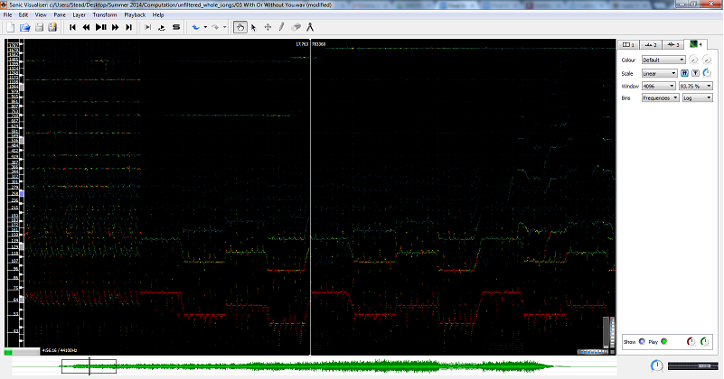
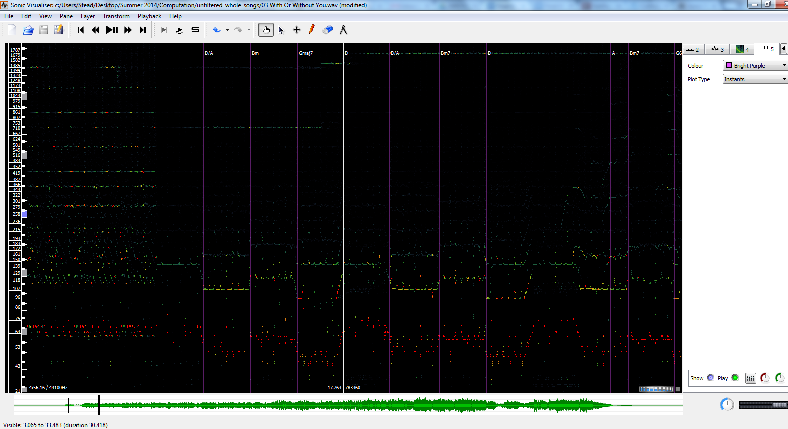
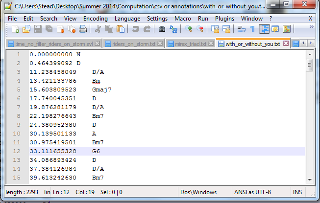

# {{ page.title }} #

## by {{ page.author }} ##

Our goal was to measure accuracy and effectiveness of digital signal processing (DSP) in chord recognition by using chordino to retrieve chords from .wav files and writing scripts that would be used to compare the chordino output with the same song’s mirex file (obtained from the McGill Billboard corpus data).  Various limitations to using DSP were found when it came to note polyphony and differentiating between the chords of a song and a melody while both play simultaneously.

Initially, our knowledge of Digital Signal Processing was that we could take a sound file, apply algorithms to it, and convert it to a form that would allow us to pull useful information from.  In particular was this idea of a Fast Fourier Transform algorithm (FFT), which would allow us to pull apart the sound wave into its individual pieces (or frequencies).

The term frequency describes how many times something occurs per second.  Tapping your foot once per second would be a rate of 1 Hertz while tapping your foot twice would be a frequency of 2 Hertz.  As individual notes in music correspond to specific frequencies it was believed that it was possible to read a song in the .wav format, perform a FFT algorithm, pull out the frequencies of the song, map each frequency to a note, and discover what chords were being used.  Chords are generally three or more notes played at once to produce a particular sound.  Examining how the chords change (chord progression) then allows us to state something significant about the harmony of the song.

There are many methods and programs that allows a user to read in a sound file and manipulate it.  The learning curve for these programs, programming languages, and algorithms is steep for both experienced musicians and computer scientists alike.  With only a week to find a way to find a method to computationally (with a program, not a human) extract the chords from a song, many programs were attempted and quickly abandoned as a result of that learning curve.  

FMOD is a popular sound manipulation library for the language C/C++ but requires programming knowledge and a working development environment to use.  Tutorials for its use are generally for a Windows Environment, and the Linux instructions are out-dated in some cases by nearly 10 years, so while it is considered to be a very  robust industry tool it did not appear to be usable within the time given for the course.  

Numpy and Scipy are scientific libraries for Python for performing calculations which also contain methods for implementing the FFT algorithm.  Python is a very popular programming language due to its intuitive and approachable learning curve.  This process actually produced the successful decomposition of sound files into its frequencies by applying the methods used in the many tutorials online which explain how to perform frequency analysis.  Making use of that data, however, to examine what notes were played when (frequency at a given time) proved to be a greater challenge than anticipated.  A toolset was then discovered which produced better results than what Numpy/Scipy/Matplotlib were giving so the Python project was eventually abandoned.

Sonic Visualizer is a free program by the Queen Mary University of London.  It contains a large set of tools and visualizations for the purpose of examining the properties of a sound file.  Using the spectrogram allows the user to see the frequencies that occur at a given time.

**Figure 1.** Spectrogram of "With or Without You," U2

This tool has the enormous advantage of giving a visualization to what is being played when.  It allows non-musicians who do not have ear training to see the music and the structure of the song and make useful observations with a minimal musical vocabulary.  (Such as the chord progression of With Or Without You under assumption that the bass guitar, which is in red, is carrying the harmony of the song, Fig1).  While this was an improvement over other approaches, a plugin was soon discovered for Sonic Visualizer called NNLS Chroma and Chordino which allowed for automatic chord detection.

**Figure 2.** Spectrogram of "With or Without You," U2, with “Chordino Chord Estimate” Transform

Chord estimates are then performed and added as a Layer to Sonic Visualizer.  Under the File menu there is an option to “Export Annotation Layer” which will produce a file that contains the time a chord is played, fig 3. (Ensure to save as .txt or else you will get a frame number instead of a time).

**Figure 3.** Output of “Export Annotation Layer” after using “Chordino Chord Estimate”

In order to conduct a preliminary estimation on the accuracy of the chords, a parser was built in Python which read in two types of annotations - the first produced by Chordino and the other in the mirex format provided by the McGill Corpus.  The chords were then compared and a miss/match score computed.  "With or Without You," U2, scored a 71% match rate with a small error discovered on how some files deal with chord inversions and is expected to slightly increase upon resolution.  Another error later discovered in the mirex version of "I Put A Spell On You," Creedence Clearwater Revival, where an A minor chord is labeled on the mirex file at 12 seconds, but which does not exist in the music, later put doubt on how useful the comparison to mirex files could be.

As we progressed through the DSP experiment, we realized two major issues with our results.  The first music theory issue we encountered was the output of our Chordino was not exactly matching up with the corresponding Mirex files. We have found that the Mirex files were extremely simplified, while the Chordino files were not.  The Mirex files tended to not account for chord inversions, altered chords, and extraneous chord tones.  This seems to be  a major limitation on the true chord analysis process.  To resolve this issue, we had to normalize our Chordino output to fit into the parameters of the Mirex files.  Another issue we came across was the skewed timestamps when using different filters and no filters. This was due to the vocals throwing off the Chordino program in its effort to analyze the harmony.

 

In order to accurately gauge the effectiveness of DSP, it is important to have accurate chord data to compare it with.  Since chord databases generally do not include other notes in the chord besides the basic triad, it is also important to convert the DSP output to triads that would be synonymous with those in the chord databases.  As an example, DSP might detect a D6, because the vocals are singing the 6th note on the D chord, but in reality it is still a D chord and would show in any chord sheet as a D.  What to remove and when can be a bit tricky since it can also be a D6 chord as well.  There are other problems, such as melodies triggering chord changes in the DSP algorithm, which would affect the time data on chord changes.  Perhaps a DSP algorithm that can detect changes in timbre and can be able to differentiate between melodies and chords could fix this problem. 

FMOD Links:
[http://katyscode.wordpress.com/2013/01/16/cutting-your-teeth-on-fmod-part-4-frequency-analysis-graphic-equalizer-beat-detection-and-bpm-estimation/](http://www.google.com/url?q=http%3A%2F%2Fkatyscode.wordpress.com%2F2013%2F01%2F16%2Fcutting-your-teeth-on-fmod-part-4-frequency-analysis-graphic-equalizer-beat-detection-and-bpm-estimation%2F&sa=D&sntz=1&usg=AFQjCNFaNeGRBWorMorIw95WKagnlxAuaw)

### Numpy Links ###

[https://sites.google.com/site/haskell102/home/frequency-analysis-of-audio-file-with-python-numpy-scipy](https://www.google.com/url?q=https%3A%2F%2Fsites.google.com%2Fsite%2Fhaskell102%2Fhome%2Ffrequency-analysis-of-audio-file-with-python-numpy-scipy&sa=D&sntz=1&usg=AFQjCNElXNnx_bxwtcxiUD6B8USZ2TLniA)

[http://willdrevo.com/fingerprinting-and-audio-recognition-with-python.html](http://www.google.com/url?q=http%3A%2F%2Fwilldrevo.com%2Ffingerprinting-and-audio-recognition-with-python.html&sa=D&sntz=1&usg=AFQjCNEJAI61Hxc-xoyPJzq6YP8c6XNj0w)

### Sonic Visualizer and Chordino Links ###

[http://www.sonicvisualiser.org/](http://www.google.com/url?q=http%3A%2F%2Fwww.sonicvisualiser.org%2F&sa=D&sntz=1&usg=AFQjCNHpFUcqK4asDJV_kfPYhXAX_CUCmA)
[http://www.vamp-plugins.org/download.html](http://www.google.com/url?q=http%3A%2F%2Fwww.vamp-plugins.org%2Fdownload.html&sa=D&sntz=1&usg=AFQjCNFdViCEj3L6ogUodhk8uzR8hdTrnQ)

### McGill Billboard Corpus ###

[http://ddmal.music.mcgill.ca/billboard](http://www.google.com/url?q=http%3A%2F%2Fddmal.music.mcgill.ca%2Fbillboard&sa=D&sntz=1&usg=AFQjCNGPjlHiq8-zrKzjf1DXD9hXNGk7UQ)

### Chordino / Mirex File Parser and Comparator ###

[https://github.com/corpusmusic/dsp\_chordino](https://www.google.com/url?q=https%3A%2F%2Fgithub.com%2Fcorpusmusic%2Fdsp_chordino&sa=D&sntz=1&usg=AFQjCNHP8eVmDuZS-2U3xMFHO44-LXzdQQ)

