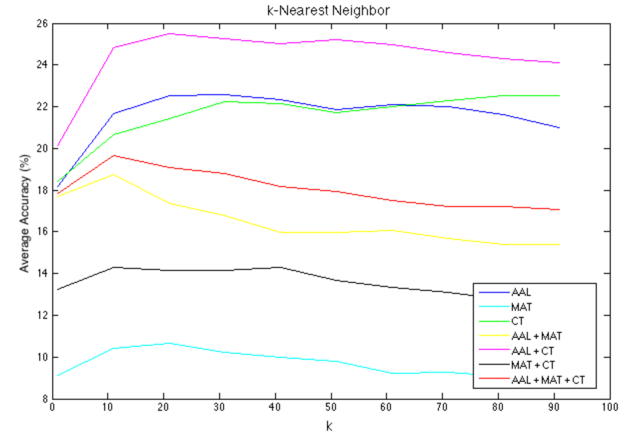
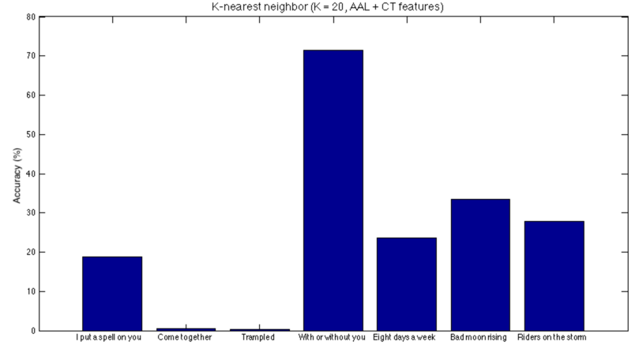
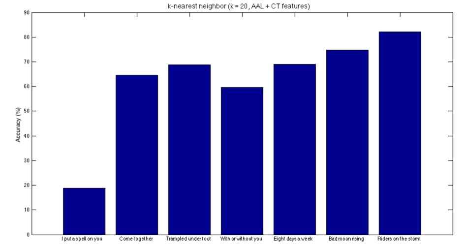
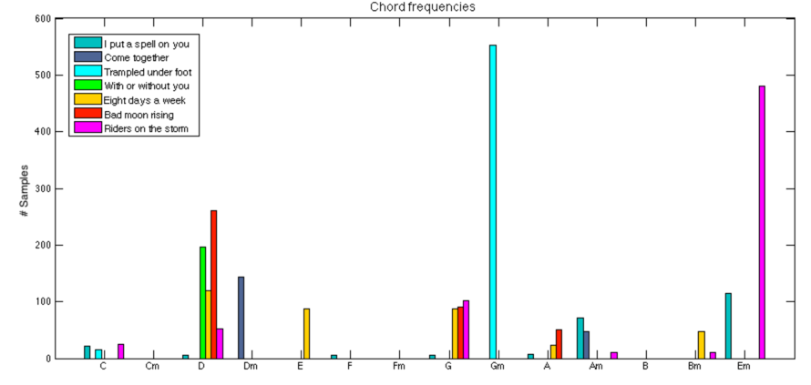

# {{ page.title }} #

## by {{ page.author }} ##

Machine learning systems are those that can learn from data. They learn by example and aim to generalize well on new, unseen data. Learning can be achieved by following this “equation”: LEARNING = REPRESENTATION + EVALUATION + OPTIMIZATION.

## Representation ##

In order to generalize we need a good amount of data (the more, the better) but most importantly we need a good representation of the data (features). Feature engineering might be the hardest stage in the design of any learning algorithm; no matter how good an algorithm is if the data is not representative and discriminative enough.

For the purpose of automated chord recognition, we used the harmonic transcription of seven songs from the McGill Billboard dataset. We extracted audio pieces for each chord in each song and ended up with 2637 audio signals with their corresponding chord label. Note that since we are working with a very small audio corpus, not all the chords are going to be present in these samples.

For the purpose of feature extraction, we used the following Matlab toolboxes: the [Audio Analysis Library](http://www.mathworks.com/matlabcentral/fileexchange/45831-matlab-audio-analysis-library), the [Chroma toolbox](http://resources.mpi-inf.mpg.de/MIR/chromatoolbox/), and the [Music Analysis toolbox](http://www.pampalk.at/ma/).

The Audio Analysis Library (AAL) extracts a series of short-term features through small windows. Then, bigger windows are used to extract mid-term statistics (e.g. mean, median, standard deviation, …) from the short-term features. The short-term features extracted are: chroma vectors, energy, entropy of energy, harmonic ratio and fundamental frequency, MFCCs (Mel Frequency Cepstrum Coefficients), spectral centroid, spectral entropy, spectral flux, spectral rolloff and zero-crossing rate.

The Chroma Toolbox (CT) decomposes an audio signal into 88 frequency bands with center frequencies corresponding to the pitches A0 to C8. Then, for each subband, it computes the short-time mean-square power (STMSP), indicating the presence of certain musical notes within the audio signal [2]. Moreover, CRT (Chroma DCT-reduced log pitch) and CLP (Chroma log pitch) features are also extracted.

Finally, the Music Analysis Toolbox (MAT) transforms the audio signal to sone (specific loudness sensation) and MFCCs (Mel Frequency Cepstrum Coefficients). Further features consist of an spectrum histogram, a periodicity histogram and a fluctuation pattern.

Once the above features have been extracted, we conducted a series of experiments for feature selection. Fig. 1 shows a graph with the average prediction accuraries for each combination of features when performing a simple k-nearest neighbor classifier. As observed, the combination of AAL and CT features provides the highest accuracy.

**Figure 1.** Average accuracy values using  a k-Nearest Neighbor classifier [Feature selection]

An average prediction accuracy of 25% is really bad! What happened? In order to answer this question we present the accuracy of each leave-one-song-out cross-validation (LOSOCV) in Fig. 2.

**Figure 2.** Accuracy values per each song using LOSOCV (k-Nearest Neighbor, k = 20)

U2’s "With or Without You" chords are correctly predicted 72% of the time. On the other hand, "Trampled Under Foot" chords are never correctly predicted. This occurs because the chords in "Trampled Under Foot" (mainly G minor) do not appear in the training corpus (remaining six songs). Classification algorithms can’t learn what they haven’t seen before! The accuracy values obtained are then suffering of this problem and hence are not informing us how well does the classifier perform. We then decided to compute fair prediction accuracies by only considering those chords that exists on the training set. The resulting prediction values look much better! Except for I put a spell on you, chords are correctly predicted 60% to 82% of the time in the remaining 6 songs as shown in Fig. 3. Refer to Fig. 4 for a more detailed view of chords present in the corpus used. Note that other chords are also present in some of the songs (e.g. B7) but they have been omitted as they only appear in one of them.

**Figure 3.** Fair accuracy values per each song using LOSOCV (k-Nearest Neighbor, k = 20)

**Figure 4.** Chord frequencies
