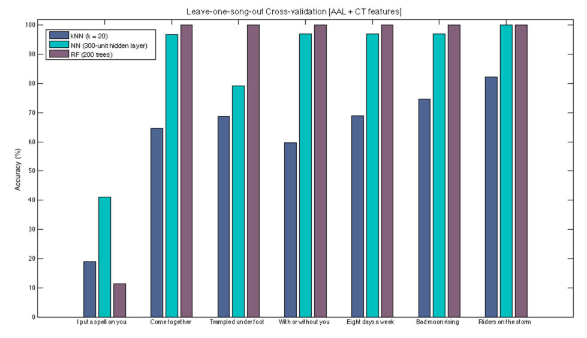
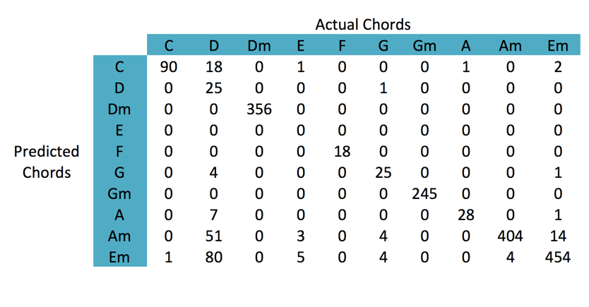

# {{ page.title }} #

## by {{ page.author }} ##

## Evaluation ##

In machine learning is generalization that counts. To guarantee generalization and not overfitting of the training data we use cross-validation techniques. These allow us to assess how the results of a statistical analysis will generalize to an unseen data set by partitioning the data into complementary subsets and repeatedly evaluating on each subset. We use leave-one-song-out cross-validation (LOSOCV) to guarantee that our predictor is able to determine chords for new songs and it is not biased by the auditory information of the own song.

We have previously shown results for chord recognition using k-nearest neighbor, which is one the simplest classification algorithms. Basically, it returns the k closest training examples in the feature space by computing the distances between every pair of samples. Here we used Euclidean distance.

We tried other common classification algorithms such as a neural network (NN) and a random forest (RF) and obtained improved results (see Fig. 1). In particular, the random forest algorithm with 200 trees achieves 100% prediction accuracy for six of the seven songs, but performs poorly on "I Put a Spell on You."

Extending the experiments to a larger dataset of songs is necessary to evaluate the generalization performance for a random forest and the neural network to determine which classification algorithm is doing better. Results so far look promising but the dataset is not large enough to provide conclusion with enough confidence.

**Figure 1.** LOSOCV results for k-Nearest Neighbor, Neural Network and Random Forest.

Finally, we show the confusion matrix obtained from the random forest experiment in Fig. 2. Note that all the errors are induced from I put a spell on you and so further analysis of the confusion matrix shows that D chords and E chords are often confused with E minor and A minor chords mostly.

**Figure 2.** Confusion matrix [Random Forest]

